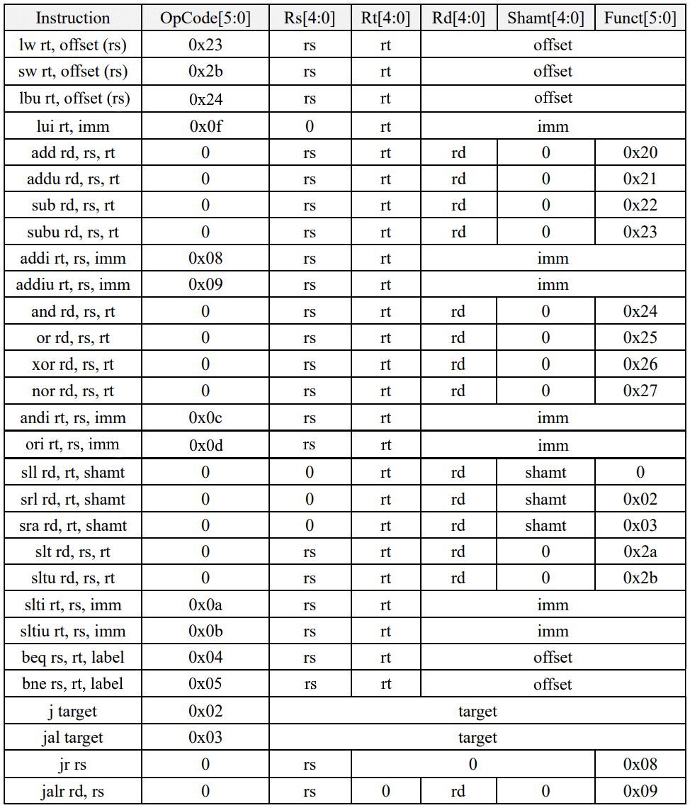
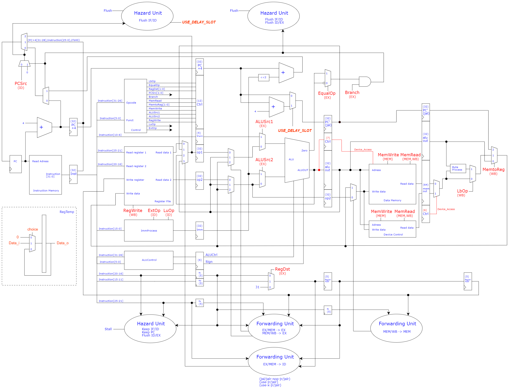

# 基于MIPS指令集子集的五级流水线微处理器

大二下暑期《处理器基础实验》大作业部分内容。使用流水线处理器思路进行设计，支持包括以下29条MIPS指令的MIPS指令集子集：（lbu、ori、bne为自行添加指令）

数据通路设计如下：（Device Control为外设控制器，为独立于数据存储器的存储器）

其他相关说明（包括资源占用及时序性能）详见./introduction.pdf。